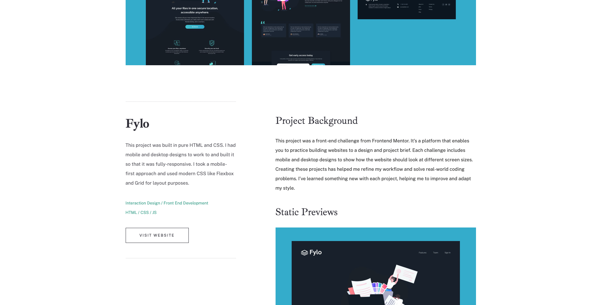
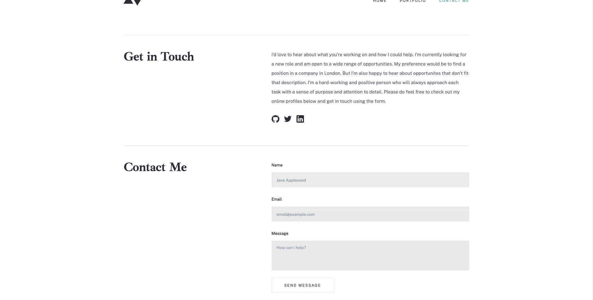
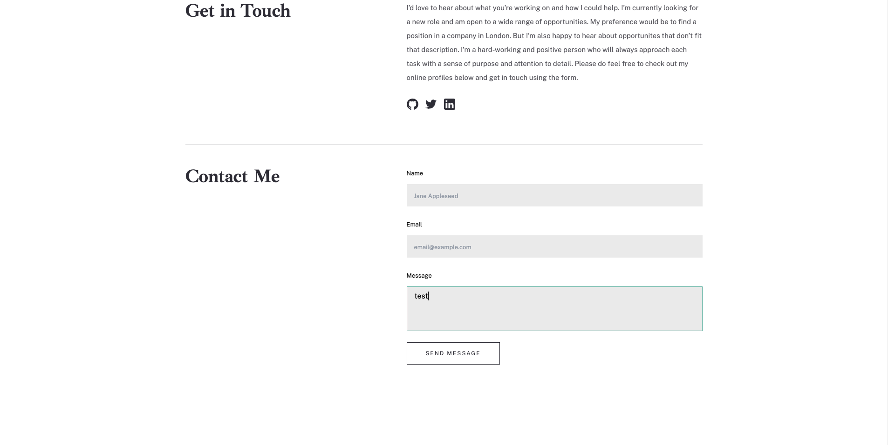

# Portfolio template website

## Table of contents

- [Overview](#overview)
  - [The App](#the-app)
  - [What it looks like](#what-it-looks-like)
  - [How to run the app ?](#how-to-run-the-app)
- [My process](#my-process)
  - [Built with](#built-with)
  - [What I learned](#what-i-learned)
  - [Continued development](#continued-development)

## Overview

### The App

This website is a template portfolio website with a minimalist design. It is available on desktop/laptop, tablet and mobile devices.

Check it out here : https://dlndev_minimalistportfolio.surge.sh/

### What it looks like

Desktop hompepage overview :


Portfolio index page :


Project details page :




Contact me page :




### How to run the app locally ?

Clone the project, then jump into your command line and run these :

```bash
# install dependencies
yarn

# start the application
yarn start

# open the application in the browser
open http://localhost:3000
```

## My process

### Built with

- Semantic HTML5 markup
- Flexbox
- Mobile-first workflow
- [TailwindCSS](https://tailwindcss.com/) - Mobile-first CSS framework
- [React](https://reactjs.org/) - JS library
- [Typescript](https://www.typescriptlang.org/) - JS with an emphasis on types
- [Figma](https://www.figma.com/)

### What I learned

When I implemented React router in my project I quickly came across an issue : when changing routes the browser didn't scroll to the top of the page automatically, in the contrary it stayed at the same place where I was on the previous page.

### Continued development
