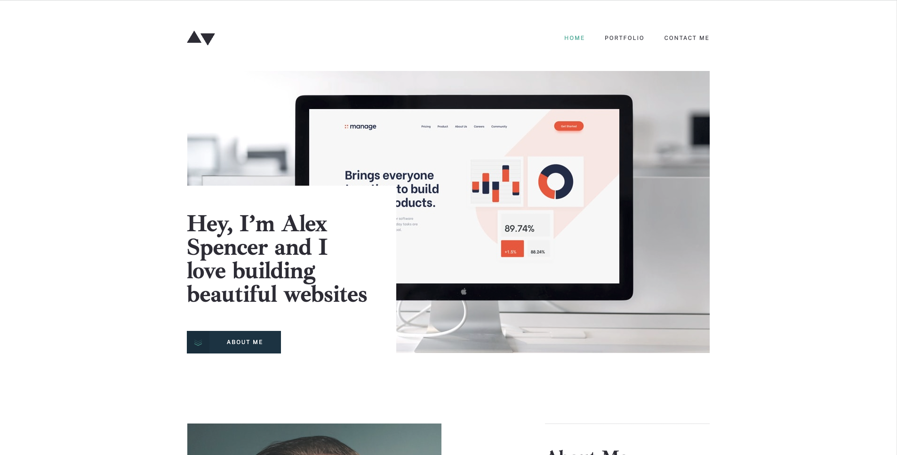
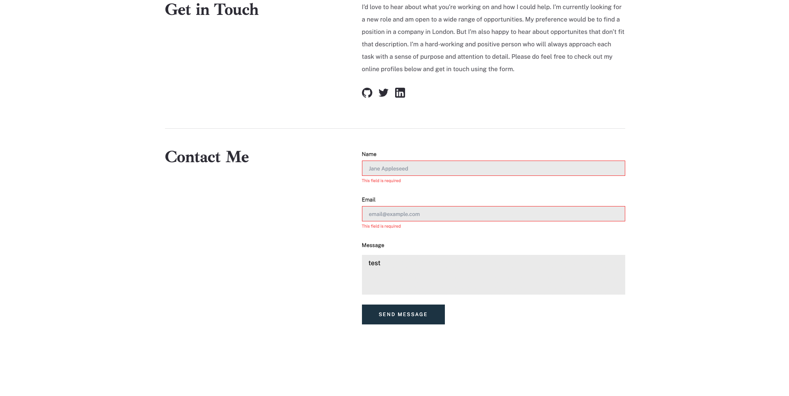

# Portfolio template website

## Table of contents

- [Overview](#overview)
  - [The App](#the-app)
  - [What it looks like](#what-it-looks-like)
  - [How to run the app ?](#how-to-run-the-app)
- [My process](#my-process)
  - [Built with](#built-with)
  - [What I learned](#what-i-learned)
  - [Continued development](#continued-development)

## Overview

### The App

This website is a template portfolio website with a minimalist design. It is available on desktop/laptop, tablet and mobile devices.

Check it out here : https://hdln-minimalist-portfolio.surge.sh/

What you will find in this project:

- Disabled & hover effects on buttons
- Scroll to a section after clicking on a button
- Form with validation logic
- Hilighted link when being on the corresponding route
- Button made with a custom svg component, whose props are changing according to the state
- React Router v6 route nesting
- Dynamic classes that changes according to the state
- Responsive design for desktop/laptop, tablet and mobile devices
- An attempt at relevant use of html tags

### What it looks like

Desktop homepage overview :




Portfolio index page :


Project details page :


Contact me page :




### How to run the app locally ?

Clone the project, then jump into your command line and run these :

```bash
# install dependencies
yarn

# start the application
yarn start

# open the application in the browser
open http://localhost:3000
```

## My process

### Built with

- Semantic HTML5 markup
- Flexbox
- Mobile-first workflow
- [TailwindCSS](https://tailwindcss.com/) - Mobile-first CSS framework
- [React](https://reactjs.org/) - JS library
- [Typescript](https://www.typescriptlang.org/) - JS with an emphasis on types
- [ReactRouterV6](https://reactrouter.com/en/v6.3.0) - Routing library for React
- [Figma](https://www.figma.com/)

### What I learned

When I implemented React router in my project I quickly came across an issue : when changing routes the browser didn't scroll to the top of the page automatically, in the contrary it stayed at the same place where I was on the previous page.

I fixed this problem by creating a component which automatically scroll to the top of its page whenever the url pathname changes :

```js
import { useEffect } from "react";
import { useLocation } from "react-router-dom";

const ScrollToTop = () => {
  const { pathname } = useLocation();

  useEffect(() => {
    document.documentElement.scrollTo({
      top: 0,
      left: 0,
    });
  }, [pathname]);

  return null;
};
export default ScrollToTop;
```

I then put this component just before my App component so I'm sure it is interpreted systematically :

```js
const root = ReactDOM.createRoot(
  document.getElementById("root") as HTMLElement
);
root.render(
  <React.StrictMode>
    <Router>
      <ScrollToTop />
      <App />
    </Router>
  </React.StrictMode>
);
```

Continuing with the routing, I learned how to create nested routes on React Router v6.
Without nesting my routes would have looked like this :

```js
<Routes>
  <Route path="/portfolio" element={<PortfolioIndex />} />
  <Route path="/portfolio/:id>" element={<ProjectDetails />} />
</Routes>
```

With nesting it looks like this :

```js
<Routes>
  <Route path="/portfolio">
      <Route index element={<PortfolioIndex />} />
      <Route path=":id>" element={<ProjectDetails />} />
  <Route>
</Routes>
```

In the case of this project there is clearly no real advantage in using nesting but I wanted to try this new feature.

An other issue that I had was that I had trouble to change the color of the arrows in the About me button of the homepage. These arrows are in SVG format, and I wanted to change their colors on hover. I learned that there are three ways of displaying SVGs :

- Pasting the SVG code between svg tags.
- Importing the SVG and pasting its name in the source attribute of an image.
- Creating a functional component which returns the SVG.

The third solution is really flexible, because you can pass different props to the SVG component depending on the context :

```js
const CustomSvg: React.FC<Props> = ({ fill }) => {
  return (
    <span className="absolute top-[18px] left-4 w-4 h-3">
      <svg xmlns="http://www.w3.org/2000/svg" width="16" height="14">
        <g fill="none" fillRule="evenodd" stroke={fill}>
          <path d="M0 9l8 4 8-4" />
          <path opacity=".5" d="M0 5l8 4 8-4" />
          <path opacity=".25" d="M0 1l8 4 8-4" />
        </g>
      </svg>
    </span>
  );
};
```

Then you can use the SVG in any other component and give the value you want to its props :

```js
<CustomSvg fill={`${focus ? "#FFFFFF" : hover ? "#FFFFFF" : "#5FB4A2"}`} />
```

In my case I wanted the color of the arrow to be white when the button is focused, same on the hover and green when the button isn't hovered or focused.

Finally, I wanted the color of the titles in my header to change if the route matched the title.
First I had to grab the pathname in my Header component, with the help of the react router hook "useLocation":

```js
const location = useLocation();
```

Then I had to test if the location was equal to the title in the header, in which case it activates a boolean that I put on the title's class as follows :

```js
 className={`${ contactMeLinkActive ? " tablet:text-cyan" : "text-dark-blue" }`}
```

### Continued development

As the project don't have any backend I plan to had a mailto feature on the form submit, which will open the user's mail app or a gmail page on a new tab with the corresponding fields autocompleted.
